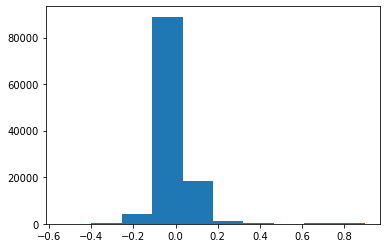

## 本周进度

###　论文

`the crux of voice (in)security a brain study of speaker legitimacy detection`

是一篇以生物学理论为基础的文章，主要方法是通过生物学方法，监测人脑在听到真假声音时候的脑内活动状态。

其主要结论是：人脑在处理真假语音的时候，脑内活动十分相似，这证明了人脑极易受到伪造语音的攻击而不自知。

`securing voice-driven interfaces against fake (cloned) audio attacks`和

`Towards Vulnerability Analysis of Voice-Driven Interfaces and Countermeasures for Replay Attack`

这两篇文章是由同一个人做的，属于一个系列，而且都属于最新的结果。

第一篇文章提出新的一个新的HOSA方法（高阶频谱分析），并做了一些数据测试，但是数据量比较少。结果不错，

第二篇文章，是在上一篇的基础上，在一个重放攻击的环境中，对Google Home这种应用进行攻击，并采用HOSA方法进行防御。结果证明这种方法是有效的。

两篇的缺陷都在于检测方法着重于数学方法检测，这种方法在初期是有效的，但如果换了生成语音的系统，可能效果并不会那么好。

其中第一篇的思路有一点与我下面的第二种方法有相似。而且这个方法可以用来提升语音生成的逼真性。

###　尝试方法

之前的工作已经准备了一些列语音数据用于测试，在此基础上尝试了两种方法测试。

虚假声音频谱

真实声音频谱

首先是尝试比对声音的内部特征稳定性。

对于任意一段长度的语音，都可以提取其embedding特征，如下图

具体的我把一段声音划分为10段，用第一段声音作为基础比对参照，比较其后九段声音embed与第一段的相似度，得到下图。蓝色是真实语音，橙色是虚假语音，可以看出略有区别。但不足以区分。

其二是注意到生成语音的波形图，虚假语音有更多的噪音（底噪）。猜测其在波值分布上会有区别，例如下面两张图，第一张是虚假语音，第二章是真实语音。可以看到虚假的分布更加尖锐。

在此基础上和已有的数据，写了一个小的神经网络进行训练。最后网络在判断真假语音上的成功率是0.68 。略有结果但不明显，准备继续改进，还可以把上一条的结论放到一起进行测试。

