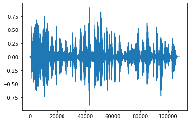
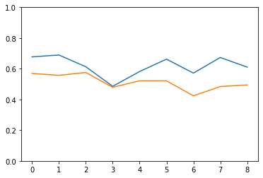

## 本周进度

###　Papers

`the crux of voice (in)security a brain study of speaker legitimacy detection`

It is an article based on biology. The main method is to monitor the brain's activity state when the human brain hears the true and false sounds through biological methods.

The main conclusion is that when the human brain processes the true and false voices, the activities in the brain are very similar, which proves that the human brain is highly vulnerable to forgery of speech and does not know.

`securing voice-driven interfaces against fake (cloned) audio attacks`和

`Towards Vulnerability Analysis of Voice-Driven Interfaces and Countermeasures for Replay Attack`

These two articles are written by the same person and their results are latest.

The first article proposes a new HOSA method (high-order spectrum analysis) and does some data testing . The result is good,but the amount of data is relatively small

The second article, based on the previous article, attacks Google Home in an environment of replay attacks and uses the HOSA method for defense. The results prove that this method is effective.

The downside of both is that the detection method focuses on mathematical methods. This method is effective at the beginning, but if you change the system that generates the speech, the effect may not be so good.

One of the ideas in the first one is similar to the second method below. And this method can be used to improve the fidelity of speech generation.

###　Methods Tried

Previous work has prepared a few columns of voice data for testing, and based on this, tried two methods of testing.

wave of fake voice

wave of true voice

First, I try to compare the stability of the internal features of the sound.

For any length of speech, you can extract its embedding feature, as shown below

Specifically, I divided a section of sound into 10 segments, and used the first segment of sound as the basis for comparison. I compared the similarity between the next nine segments of the sound embed and the first segment, and the following figure is obtained. Blue is the real voice, orange is the false voice, you can see a slight difference. But not enough to distinguish.

The second is that I noticed the waveform of the generated speech, and the false speech has more noise (noise around zero). It is guessed that there will be differences in the distribution of wave values, such as the following two figures, the first is a false voice, and the second is a real voice. You can see that the false distribution is more acute.

Based on this and existing data, a small neural network was written for training. Finally, the success rate of the network in judging true and false voices is 0.68. A little result but not obvious, ready to continue to improve, I  plan to put the conclusions of the previous one together for testing.

Histogram of fake voice

Histogram of true voice

