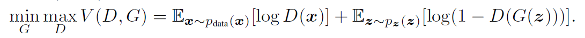
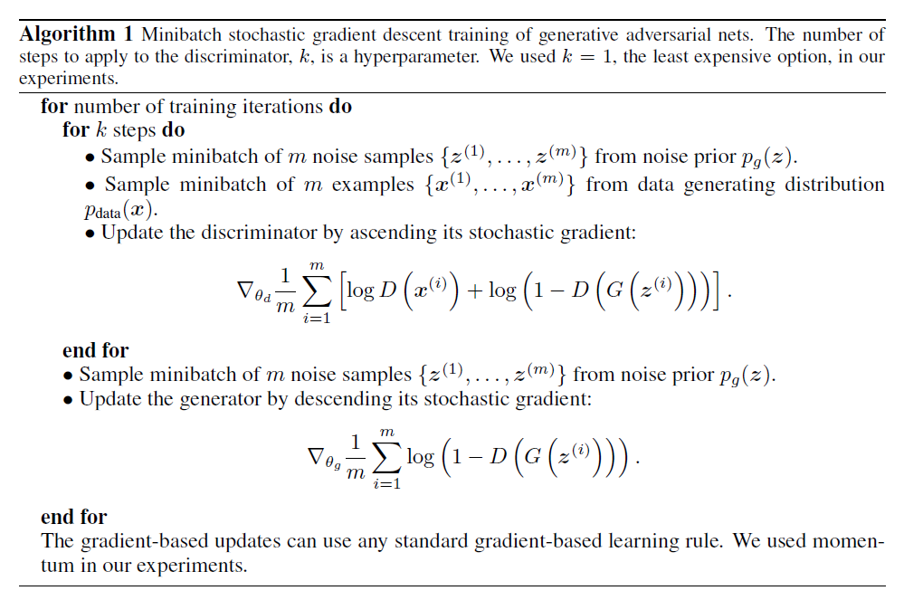

## 9.18 工作总结
###读论文 《Generative Adversarial Nets》
论文内容
>通过不断训练生成模型G与判别模型D，使G能够恢复真实数据集的分布。

>由于论文中的生成模型和判别模型都是_多层感知器结构(多层神经网络)_结构，可以使用反向传播和dropout算法进行训练，不需要 _近似推理和马尔科夫链 approximate inference or Markov chains_ 。

>D和G的训练是关于下函数的极小极大博弈问题
> > 
> > x表示任意数据(可以是真实数据集也可以是生成的)，z是输入到G的一个随机噪声，Pz(z)是z噪音的先验概率 _(就是z的分布吧)_ ，D(x)表示x来自真是数据集分布的概率。
> > 这个公式的合理性：当只考虑D的变化时，第一项数据来自真实集，所以希望D(x)为1，	第二项数据为生成的，所以希望1-D(G(z))为1，那么对两项合取最大值是合理的。当只考虑G的变化时(此时G一定),则希望使D(G(z))为1，此时为后项取最小值。综合而言，演变成了极小极大博弈问题。
	
>训练方法：
> > 
> > 简单翻译就是：执行k次判别器更新后执行一次生成器更新，注意判别器更新使用_梯度上升_，生成器更新使用_梯度下降_。

>证明过程……

>一些点：
> > 学到的数据分布是隐式表示(用G网络)，训练中需要保证D与G很好地同步。
> > _条件生成模型p(x,c)可以让c作为G和D的输入_ 
> > 半监督学习怎么做？
> > _训练辅助网络学习近似推理，实现给定x到z的预测，与wake-sleep算法类似_
> > _利用生成对抗网络来随即拓展确定的MP-DBM_ 